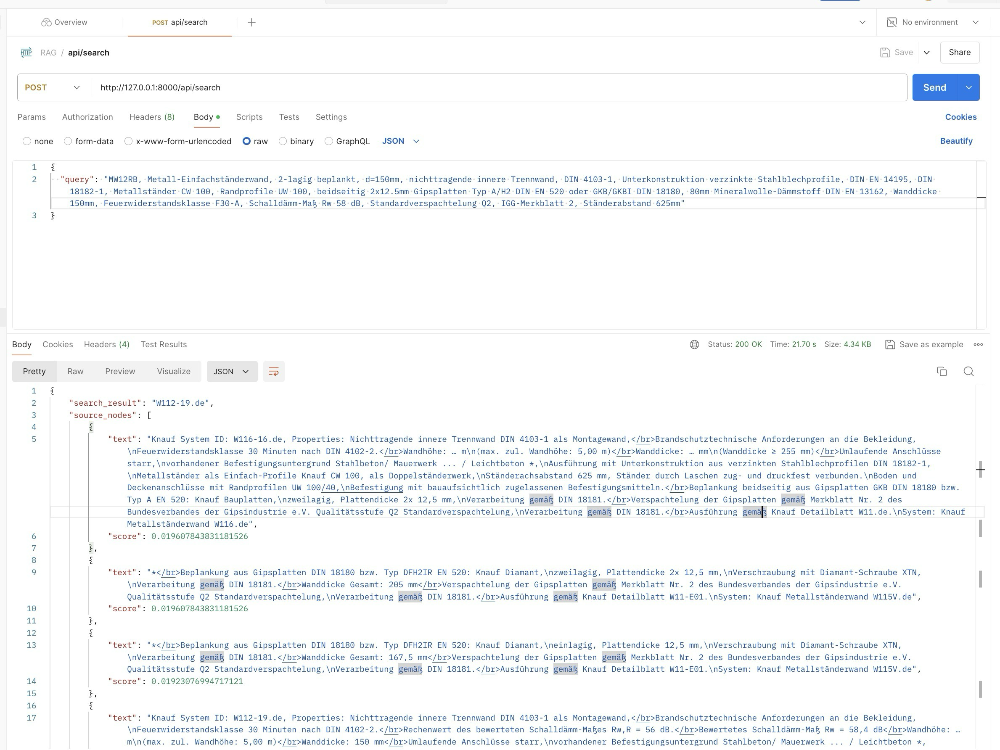

# RAG: Research-assistant


This project aims to help researchers find answers from a set of research papers with the help of a customized RAG pipeline and a powerfull LLM, all offline and free of cost.

For more details, please checkout the [blog post](https://otmaneboughaba.com/posts/local-rag-api) about this project.

## How it works


1. Download some research papers from Arxiv
2. Use Llamaindex to load, chunk, embed and store these documents to a Qdrant database
3. FastAPI endpoint that receives a query/question, searches through our documents and find the best matching chunks
4. Feed these relevant documents into an LLM as a context
5. Generate an easy to understand answer and return it as an API response alongside citing the sources

## Running the project

#### Starting a Qdrant docker instance

```bash
docker run -p 6333:6333 -v ~/qdrant_storage:/qdrant/storage:z qdrant/qdrant
```

#### Downloading & Indexing data

```bash
python rag/data.py --query "LLM" --max 10 --ingest
```

#### Starting Ollama LLM server

Follow [this article](https://otmaneboughaba.com/posts/local-llm-ollama-huggingface/) for more infos on how to run models from hugging face locally with Ollama.

Create model from Modelfile

```bash
ollama create zephyr-tender-text -f ollama/Modelfile 
```

Start the model server

```bash
ollama run zephyr-tender-text
```

By default, Ollama runs on ```http://localhost:11434```

#### Starting the api server

```bash
uvicorn app:app --reload
```


## Example

#### Request



#### Response


#### LATEST:
```
conda activate llamaindex_latest_1
uvicorn app:app --reload
```

To ingest data and create a new DB, modify the config yaml file with desired DB name and run:

``` 
python data_milvus.py --ingest
```

### TODO: Refactor ServiceContext to llamaindex Settings API

<!-- TODO: Add detailed steps for refactoring ServiceContext to use the llamaindex Settings API. Include code examples and configuration changes required. -->