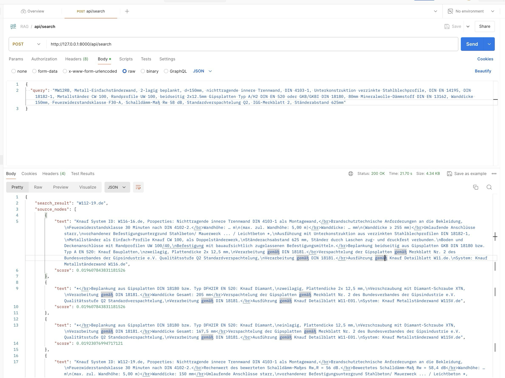

# RAG: Knauf Tender text from Competitor tender


This project aims to help finding Knauf Tender text from Competitor tender text data with the help of a customized RAG pipeline and a powerfull LLM


## How it works

1. Use Llamaindex to load, chunk, embed and store these documents to a Milvus or Qdrant database
3. FastAPI endpoint that receives a query/question, searches through our documents and find the best matching chunks
4. Feed these relevant documents into an LLM as a context
5. Generate an easy to understand answer and return it as an API response alongside citing the sources
6. Monitor with telemetry tool: Phoenix arize

## Running the project

#### Install dependency with Poetry

```bash
> poetry install

```

#### Starting a the telemetry server

```bash
> python -m phoenix.server.main serve

```
#### Starting the backend service

```bash

> uvicorn app:app --reload

```
#### Starting Frontend chat

```bash

> streamlit run streamlit_app.py

```

#### DATA: Ingest data into vector store
To ingest data and create a new DB, modify the config yaml file with desired `milvus.uri` name and `data_path`

``` 
python rag_tender_export_fastapi/services/data_milvus_service.py --ingest
python rag_tender_export_fastapi/services/data_qdrant_service.py --ingest
```


#### Starting a Qdrant docker instance

```bash
docker run -p 6333:6333 -v ~/qdrant_storage:/qdrant/storage:z qdrant/qdrant
```


#### Starting Local Ollama LLM server

Follow [this article](https://otmaneboughaba.com/posts/local-llm-ollama-huggingface/) for more infos on how to run models from hugging face locally with Ollama.

Create model from Modelfile

```bash
ollama create zephyr-tender-text -f ollama/Modelfile 
```

Start the model server

```bash
ollama run zephyr-tender-text
```

By default, Ollama runs on ```http://localhost:11434```


## Example

#### Request



